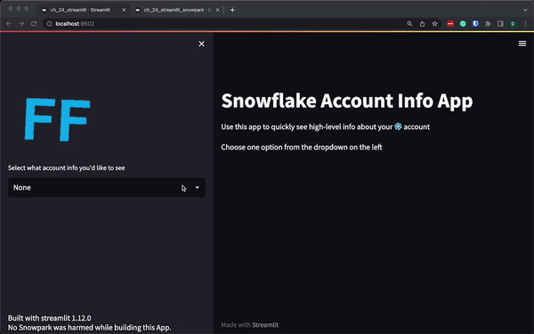

# Challenge 24
## My solution:
I reused the code from challenge 12, only to later realise that we were supposed to use Snowpark. So ended up tweaking the original solution:
- One approach without Snowpark (just regular snowlake connector)
- One with Snowpark -- could reuse most of it, just some minor tweaks needed.

## the prompt
Week 24 – Intermediate

To celebrate the release of Snowpark for Python into GA and the release of the Streamlit integration into private preview, we’re going to do a doubled up Snowpark and Streamlit challenge!

Your challenge is to create an app that looks like the one below:

Requirements:

* You must allow the user to select between the following objects:  
  * ‘None’  
  * ‘Shares’  
  * ‘Roles’  
  * ‘Grants’  
  * ‘Users’  
  * ‘Warehouses’  
  * ‘Databases’  
  * ‘Schemas’  
  * ‘Tables’  
  * ‘Views’  
* The app should display the FF logo  
* It should display the version of Snowpark you are using  
* It should display the results of show statements as a dataframe  
* Schemas, tables, views and grants should be on the account level (i.e. not per database etc…)  

